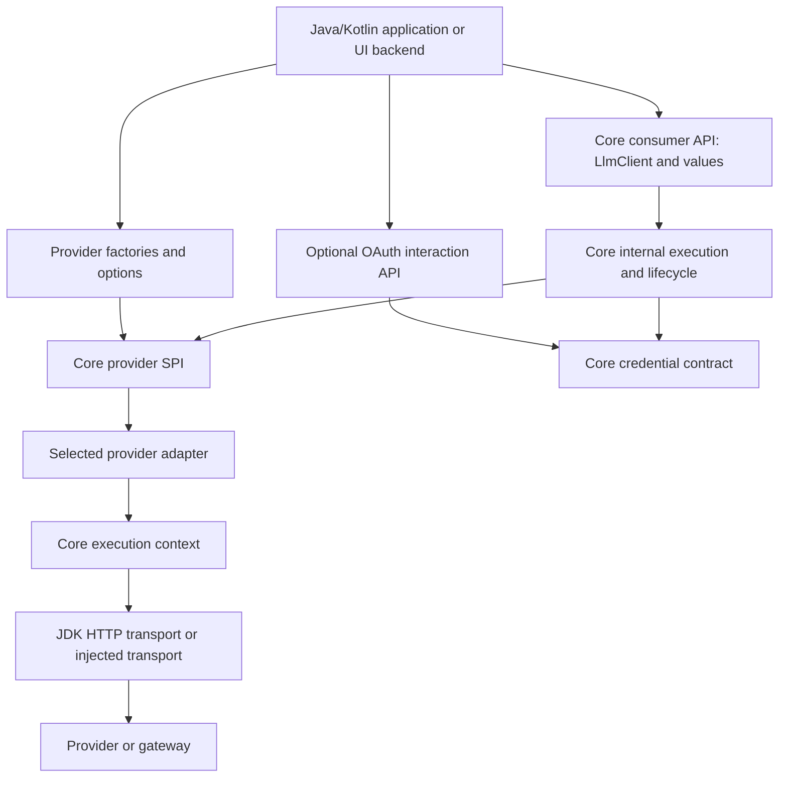

# LLM Transport SDK: architecture and public API proposal

**Status:** Architecture draft; proposed APIs, not an implemented SDK.  
**Date:** 27 September 2026. Requirements snapshot: 26 September 2026.  
**Scope:** A Java library for LLM connection, authentication, discovery, request execution, and streaming, usable from Java and Kotlin.

## 1. Recommendation and intended experience

Build a **sync-first, endpoint-bound `LlmClient`**. Give it direct generation and streaming methods, focused connection and model APIs, and a small provider SPI. Supply provider factories that assemble protocol behavior and endpoint defaults. Keep OAuth in an optional dependency that ships early and exposes an explicit interaction lifecycle to the host application.

The common caller should need a provider, credentials, a model, and input:

```java
// Proposed API. modelId is a model chosen by the application or its user.
try (LlmClient client = LlmClient.builder()
        .provider(Providers.openAiResponses())
        .apiKey(Secret.env("OPENAI_API_KEY"))
        .defaultModel(modelId)
        .build()) {
    GenerationResult result = client.generate("Explain Java records briefly.");
    System.out.println(result.text());
}
```

`generate(String)` returns the full structured result. `text()` is a convenience projection; usage, tools, finish status, native items, and continuation information remain available. Construction performs local validation only. Calling `generate` starts network work.

Use three initial artifacts, introduced as their slices are built:

1. **`llm-transport-core`** — consumer API, intentional provider SPI, execution, default JDK HTTP transport, and common JSON value support.
2. **`llm-transport-providers`** — dependency-light protocol adapters, shared framing decoders, provider presets, and typed provider options. Consumers normally depend on this artifact, which brings core transitively.
3. **`llm-transport-auth-oauth`** — interactive authorization, device authorization, refresh, and a token-store integration point. Consumers add it when needed.

Use packages to organize responsibilities within these artifacts. Add further artifacts only for a significant optional dependency, a distinct resource lifetime, or an independently useful integration.

### Consequential assumptions

- Recommend **Java 21** as the baseline, with ordinary blocking calls suitable for platform or virtual threads. Java 17 is a possible compatibility decision before implementation, not a second runtime strategy to build speculatively.
- Java desktop/IDE applications call the library directly. Browser frontends call an application backend that uses the SDK. A Java SDK does not run directly in a normal browser.
- Kotlin uses the same Java API; coroutines are an optional later adapter.
- The phrase “should not be lightweight, modular…” in the request appears inconsistent with its repeated request for a lightweight, modular design. This proposal follows the repeated intent: capable, modular, readable, and small by default.
- The repository currently contains requirements, skill material, and a short README; there are no existing SDK types, build descriptors, or compatibility obligations to preserve. Package names and Maven coordinates below are provisional.

**Navigation:** [Requirements synthesis](#2-what-the-four-requirements-documents-establish) · [Architecture](#4-architectural-boundaries-and-dependency-direction) · [Project structure](#5-project-and-package-structure) · [API](#6-public-api-backbone) · [Configuration](#8-configuration-and-endpoints) · [OAuth](#9-authentication-and-oauth-interaction) · [UI and streaming](#11-events-streaming-and-ui-threading) · [Provider SPI](#13-provider-spi-and-factories) · [Delivery](#14-initial-skeleton-and-incremental-delivery).

## 2. What the four requirements documents establish

### 2.1 Critical comparison

The documents overlap heavily. They are alternative baselines, not four additive specifications. Requirement IDs must be qualified by source because their numbering systems differ.

| Source | Most useful contribution | Qualification needed |
|---|---|---|
| [detailed-astra.md](docs/requirements/detailed-astra.md) | Strong separation of core, provider-profile, and optional requirements; precise identity, uncertainty, lifecycle, side-effect, and native-fidelity contracts. | Its inventory is much larger than an initial release. Async requirements need reconciliation with the selected sync-first skill. Its provider observations remain documentation claims rather than live conformance evidence. |
| [detailed-fable.md](docs/requirements/detailed-fable.md) | Broad discovery/UI requirements; practical parameter, configuration, provider, media, and gateway coverage. | The proposed default parameter dropping, effort conversion, and large MVP conflict with predictable semantics and a compact library. Sources mix official and secondary material. |
| [detailed-opus.md](docs/requirements/detailed-opus.md) | Clear endpoint/protocol vocabulary, items-oriented data, extension points, operational pitfalls, and a broad integration map. | It explicitly says provider details were written from memory. Public access to every layer, bidirectional codecs everywhere, and its artifact/SPI inventory would create substantial implementation and compatibility obligations. |
| [short-gemini.md](docs/requirements/short-gemini.md) | Concise statement of the basic transport, authentication, model metadata, multimodal, and observability needs. | Treat its implementation checklist as ideas. Automatic stream reconnection, universal temperature mapping, schema-to-tool/grammar equivalence, and several provider examples are unsuitable as unconditional contracts. |

There is no reason to copy model rosters, prices, current API status, or endpoint compatibility tables into the stable Java API. Those belong in versioned provider profiles and refreshable observations.

### 2.2 Common requirements worth preserving

1. **Simple entry, rich results.** One common programming model for ordinary calls, with structured content and native extensions available when needed.
2. **Separate identities.** Provider, gateway, protocol, destination, credential/account scope, and model/deployment are related but different concepts.
3. **Authentication as a lifecycle.** API keys, bearer tokens, OAuth, and cloud identity require different acquisition and renewal behavior.
4. **Incremental streaming and cancellation.** Preserve event order, tool correlation, partial output, terminal evidence, and resource cleanup.
5. **Capability-aware behavior.** Unsupported, unknown, conditional, and inaccessible features must remain distinguishable.
6. **UI-ready information.** Expose connection reports, model and parameter descriptors, auth instructions, progress, usage, and actionable failures without a UI dependency.
7. **Native fidelity.** Preserve reasoning signatures, opaque continuation material, provider IDs, native options, and unknown data that affects replay.
8. **Immutable configuration with explicit precedence.** Minimal required input, meaningful defaults, secret references, and reusable settings.
9. **An extensible provider boundary.** New adapters should reuse transport and execution behavior without changing ordinary application code.
10. **A transport scope.** Tools and their results travel through the SDK; application code owns tool execution, graph scheduling, agent loops, memory, and approvals.

### 2.3 Decisions where the documents disagree

| Question | Proposed decision and reason |
|---|---|
| Sync, async, or reactive foundation? | Blocking values and a closeable blocking stream first. UI hosts use workers. Later async/coroutine adapters preserve the same call and cancellation semantics. This follows the explicitly selected skill and avoids making executors or reactive libraries mandatory. |
| Java 17 or 21? | Recommend 21 for a new desktop/server library. Verify actual consumers before publishing the first artifact. Do not claim Android support from swapping HTTP alone. |
| Unsupported fields? | Reject known unsupported explicit settings. Unknown support may be attempted only if the adapter can represent the field faithfully; report uncertainty. Never default to `WARN_AND_DROP`. |
| “Smart” conversion? | Map equivalent representations; reject semantic changes unless the caller explicitly requests a documented transformation. Temperature scales, reasoning budgets, strict schemas, and role conversion are not universally equivalent. |
| Stream reconnection? | Never transparently restart generation after visible output. A protocol-specific resume operation requires an actual upstream resume contract. SSE event IDs alone do not provide it. |
| Retry defaults? | One attempt for generation and other potentially billable mutations. Bounded retry is opt-in and still requires replayability and justified operation semantics. Read-only metadata may use a small bounded retry policy. |
| Dependency and module count? | Start with core, providers, and optional OAuth. Avoid a build module per protocol, codec, data model, or factory. |
| Provider registration? | Explicit provider instances and a small optional instance-scoped registry for configuration-driven applications. No classpath scanning or global `ServiceLoader` selection by default. |
| Native and raw access? | Typed provider options plus deliberate native services. A later gateway toolkit may expose byte passthrough and server codecs. Do not make an unrestricted `raw().post(url, body)` part of the basic facade. |
| OAuth delivery? | An early vertical slice, including a host interaction contract. Generic OAuth support does not imply that every model provider offers a third-party login flow. |
| Metadata certainty? | Unknown is a first-class state. Never use missing price as zero, missing support as false, or successful credential acquisition as proof that inference is authorized. |
| Default automation? | Automate mechanical serialization, safe connection reuse, and configured credential renewal. Keep provider selection, model choice, browser launch, probes, uploads, tool execution, and fallback explicit. |

## 3. Compare the consumer API shapes

All three designs below address the same task: configure an endpoint, generate output, inspect metadata, and use a native feature.

### A. Endpoint-bound facade — recommended

```java
try (LlmClient client = LlmClient.builder()
        .provider(Providers.anthropicMessages())
        .apiKey(Secret.env("ANTHROPIC_API_KEY"))
        .defaultModel(modelId)
        .build()) {
    GenerationResult result = client.generate(request);
    ModelPage page = client.models().list(ModelQuery.firstPage());
}
```

The client hides configuration resolution, credentials, HTTP, decoding, and diagnostics. New providers preserve this experience. Focused services make less common capabilities discoverable. The cost is maintaining a carefully limited common model and an explicit native extension path.

### B. Typed operation dispatch

```java
GenerationResult result = transport.execute(Generate.of(request));
ModelPage page = transport.execute(ListModels.firstPage());
NativeResult nativeResult = transport.execute(providerSpecificOperation);
```

This scales to many operations and makes generic workflow dispatch convenient. However, a tiny method count hides a large operation vocabulary. Cancellation, streaming, pagination, and session operations have different lifetimes that generic dispatch must still express. It also makes ordinary Java discovery less direct. Keep this as an application-level workflow adapter if demand appears.

### C. Provider-specific clients

```java
try (AnthropicClient client = AnthropicClient.builder()
        .apiKey(Secret.env("ANTHROPIC_API_KEY"))
        .build()) {
    GenerationResult result = client.generate(request);
}
```

This makes native provider features easy to discover and can be excellent for a single-provider application. A workflow application would need provider branching, multiple client construction paths, and repeated connection/UI logic. Separate provider clients also risk divergent retry, error, and lifecycle contracts.

**Choose A**, using provider factories for C's convenient setup and a narrowly scoped typed service extension for B's extensibility. The facade is a small public interface over several cohesive internal modules; it does not implement all behavior itself.

## 4. Architectural boundaries and dependency direction



The diagram shows runtime collaboration. Compile-time dependencies are simpler:

```text
application --------------------> providers ----> core
application --------------------> auth-oauth ---> core
future cloud/native adapters ------------------> core

core never depends on providers, OAuth, cloud SDKs, UI frameworks, or agents.
```

### Responsibilities

| Module / public concept | Owns | Kept elsewhere |
|---|---|---|
| `LlmClient` | A configured endpoint runtime; discovery of focused services; resource lifetime. | Protocol encoding and OAuth state machines. |
| `GenerationRequest` / `GenerationResult` | Immutable domain data and local invariants. | Network execution or mutable conversation history. |
| `GenerationCall` | One logical execution, cancellation, and its identity. | Client-wide configuration mutation. |
| `GenerationStream` | One consumer's incremental output and terminal summary. | Mandatory full transcript accumulation. |
| `Connection` | Local endpoint description, explicit checks, and optional remote info. | Permanent “logged in and connected” assumptions. |
| `Models` | Scoped catalog queries and immutable metadata snapshots. | Choosing the user's model or automatically loading one. |
| `CredentialSource` | Credentials suitable for a defined destination/account and their renewal. | Request content mapping and UI rendering. |
| OAuth module | Authorization sessions, token exchange/refresh, host instructions. | Browser UI, application-user authentication, or graph ownership. |
| Provider adapter | Protocol mapping, native options, stream grammar, and provider error interpretation. | Its own hidden retries, global config, or independent credential search. |
| Core execution | Configuration snapshots, operation policy, deadlines, credential application, transport calls, resource tracking, and diagnostic events. | Provider-specific wire meanings. |

A client binds **one endpoint, one selected protocol profile, and one account/credential context**. Model IDs remain request-level values. Multiple endpoints are multiple clients owned by the application. A workflow backend can keep an ordinary map of reusable clients keyed by connection ID and tenant; a routing framework is unnecessary for this.

## 5. Project and package structure

The tree is a target organization, not a request to create empty directories or publish all future features immediately. `io.github.<owner>.llmtransport` represents a package root to be chosen before publication.

```text
llm-transport-sdk/
  pom.xml                              # parent build and dependency management
  llm-transport-core/
    src/main/java/<root>/
      api/
        LlmClient.java
        request/                       # GenerationRequest, GenerationSettings, CallOptions
        content/                       # messages, ordered parts, tools, media references
        response/                      # GenerationResult, Usage, continuation, diagnostics
        execution/                     # GenerationCall, GenerationStream, events, summaries
        connection/                    # Endpoint, Connection, CheckReport, ConnectionInfo
        model/                         # Models, ModelRef, ModelInfo, capability/parameter facts
        auth/                          # CredentialSource, Secret, AuthStatus
        config/                        # ClientConfig, HttpSettings, immutable policies
        error/                         # LlmException and actionable categories
        extension/                     # ProviderOptions, NativeData, ServiceKey
      spi/
        provider/                      # Provider, ProviderSession, InferenceAdapter
        transport/                     # HttpTransport, request/response/body contracts
        auth/                          # constrained credential presentation and signing
      internal/
        execution/                     # ExecutionEngine, cancellation/deadline handling
        config/                        # resolution and field-level validation
        transport/jdk/                 # default HTTP implementation and body cleanup
        json/                          # selected JSON library hidden from consumer models
        catalog/                       # scoped snapshots, freshness and pagination helpers
    src/test/java/
  llm-transport-providers/
    src/main/java/<root>/provider/
      Providers.java                   # small convenience factory entry point
      openai/                         # public options/native service contracts when needed
      anthropic/
      google/
      compatible/                     # explicit compatibility profiles for custom endpoints
      gateway/                        # gateway identity, auth placement and route options
      local/                          # local runtime profiles
      internal/
        framing/                      # SSE/NDJSON framing shared by bundled protocols
        json/                         # provider wire mapping with the selected JSON library
        protocol/responses/
        protocol/chatcompletions/
        protocol/messages/
        protocol/generatecontent/
        profile/                      # service presets, tested deviations, version policy
    src/main/resources/<root>/profiles/
    src/test/                         # wire fixtures and profile conformance cases
  llm-transport-auth-oauth/
    src/main/java/<root>/oauth/
      OAuthCredentials.java
      AuthorizationSession.java
      AuthorizationRequest.java
      AuthorizationInstruction.java
      TokenStore.java
      internal/                       # code/device flow, refresh, optional loopback listener
    src/test/
  examples/                           # real caller fixtures as implementation develops
    basic-java/
    basic-kotlin/
    desktop-oauth/
    workflow-backend/
  docs/
    requirements/
    providers/                        # supported profiles, native differences and evidence
```

**Why these divisions:** `api` is for callers, `spi` for intentional implementers, and `internal` has no compatibility guarantee. Provider options are separate from common models. Protocol implementations are reusable across service presets. OAuth has a distinct interaction/security lifecycle. Two protocols justify a shared framing utility; a single helper does not justify another Maven artifact.

Use explicit JPMS exports when the chosen dependency stack supports them; export API, supported SPI, and provider option packages, never internal packages. Classpath use remains supported. Avoid requiring reflection or broad `opens` declarations for the public model.

Provider adapters do not import core internals. Bundled protocols share framing/mapping helpers inside their own artifact. They exchange JSON with core through `JsonDocument` and supported SPI values; both artifacts may use the same version-managed JSON library privately. A third-party adapter can use its own codecs while obeying SPI limits. Publish a reusable codec utility only when external adapter authors have a demonstrated need.

### Dependency policy

- Use JDK HTTP by default and one established JSON implementation internally. Select its supported version during implementation; public request/result types must not expose its tree or annotation types.
- Use a small immutable `JsonDocument` value for schemas, native JSON, and tool arguments, with parsing/serialization helpers. It is an interchange value, not a new general-purpose JSON framework.
- Keep cloud identity SDKs, provider official SDKs, telemetry, schema validators, tokenizers, YAML parsing, media conversion, server frameworks, and reactive libraries optional.
- A provider may wrap an official SDK if hidden retries can be disabled and cancellation, errors, unknown fields, and ownership satisfy this contract. Otherwise use direct HTTP mapping. Do not maintain two implementations of the same operation without a concrete need.
- Reuse a proven OAuth implementation internally where its lifecycle can satisfy these contracts. Writing cryptography or an authorization server is outside this project.

## 6. Public API backbone

The following signatures describe the intended surface; they are not source files or a complete binary API specification. Builders and imports are abbreviated for readability.

| Type | Principal methods | Contract |
|---|---|---|
| `LlmClient` | `builder()`, `generate(String)`, `generate(GenerationRequest)`, `generate(GenerationRequest, CallOptions)` | Construction is local. Each generation method performs exactly one logical call, subject to its explicit retry policy. |
| | `stream(GenerationRequest)`, `stream(GenerationRequest, CallOptions)` | Starts the call and returns a closeable stream after opening the response; failures before that are thrown. |
| | `newCall(GenerationRequest, CallOptions)` | Creates a cancellable one-shot handle without I/O. |
| | `inspect(GenerationRequest, CallOptions)` | Local resolution/validation using available metadata; returns `RequestAssessment` without remote work. |
| | `connection()`, `models()` | Obtaining these handles performs no I/O. Their method names distinguish inspection from fetching. |
| | `<S> S service(ServiceKey<S>)` | Returns an installed typed optional/native service or throws `UnsupportedFeatureException`, without network work. |
| | `close()` | Cancels client-owned active work and releases owned resources under a bounded shutdown contract. |
| `Connection` | `description()`, `check(CheckRequest)`, `fetchInfo()` | Description is local; the other methods explicitly perform bounded network work. |
| `Models` | `list(ModelQuery)`, `fetch(ModelRef)`, `snapshot()` | List/fetch may use cache under declared freshness policy; snapshot is local and may be empty/stale. |

`LlmClient` is a final concrete facade. Give interchangeable behavior interfaces where needed: providers, transport, credentials, observers, and authorization stores. Do not create `ILlmClient`, `AbstractLlmClient`, and `DefaultLlmClient` solely to mirror one implementation.

### One-shot execution and streaming interfaces

```java
// Proposed interfaces. Supporting value types are described below.
public interface GenerationCall extends AutoCloseable {
    InvocationId id();
    GenerationResult execute();
    GenerationStream stream();
    void cancel();
    @Override void close();
}

public interface GenerationStream
        extends Iterable<GenerationEvent>, AutoCloseable {
    Optional<StreamSummary> summary();
    void cancel();
    @Override void close();
}
```

Critical Javadoc contracts:

- `newCall` allocates local state only. Exactly one of `execute` and `stream` may be invoked once. A second start fails locally; it never creates another billable request.
- `cancel` is thread-safe, idempotent, and may be called before start. It interrupts SDK waits and aborts underlying work where supported. Remote completion and billing may remain unknown.
- A stream permits one iterator and one consuming thread. `iterator()` does not create a new request. A second iterator fails locally.
- Iterator reads may block. They deliver output incrementally and throw a typed failure on transport/protocol failure or cancellation. A successful end requires the selected protocol's terminal evidence.
- `summary()` is a nonblocking snapshot: absent while active, present after terminal completion, failure, or cancellation. It never drains the stream and never starts work.
- `close` before completion cancels the active call. Closing after completion releases resources without changing its outcome. Closing a call closes its stream; closing either never closes a shared client.

## 7. Requests, results, and native meaning

### Domain shape

| Value | Meaning |
|---|---|
| `GenerationRequest` | Optional model override, ordered input items, instructions, settings, tools, output contract, continuation, typed provider options. |
| `InputItem` | Message, tool result, or native replay item. Chat messages are a convenient common input form. |
| `ContentPart` | Text, inline media, remote media reference, provider file reference, or native part with explicit provenance. |
| `GenerationSettings` | Portable optional parameters whose semantics can be represented faithfully, such as temperature and output limit. Provider-specific reasoning/sampling remains typed extensions. |
| `GenerationResult` | Ordered output items/candidates, completion status, finish details, usage, request/response IDs, observed route/model, diagnostics, and continuation. |
| `OutputItem` | Message/text, tool call, provider-exposed reasoning, refusal, hosted-tool result, artifact, or native/unknown item. |
| `Continuation` | Opaque provider-bound replay material or a remote state reference, with endpoint/account/protocol/model compatibility constraints. |
| `Usage` | Optional reported counters with definitions and units; missing values remain missing. |
| `RequestAssessment` | Resolved non-secret settings, validation problems, unknowns, semantic transformations, and pending authorized work. |

`ModelRef` preserves the exact provider model/deployment identifier, with an explicit kind where a deployment differs from a model. The bound client supplies endpoint/account/protocol scope; returned descriptors and continuation/file references retain their originating scope. Ordinary `.model(String)` is a convenience for an opaque model ID. Never split IDs on `:`, strip date suffixes, or infer the provider from a model name.

Prefer immutable final classes with builders for evolving aggregate values. Small stable values can be records. Defensive copies are required for collections and byte arrays. Builders are mutable and not thread-safe.

Extensible result/event families need a documented unknown/native case and consumers must handle unrecognized kinds. A closed enum of model providers or a sealed list of every upstream event cannot be the extension mechanism. New variants can break exhaustive switches even when a release is otherwise additive; document this compatibility boundary.

### Results and partial outcomes

- `result.text()` concatenates ordinary text parts in the first candidate in order; it excludes reasoning, tool arguments, and refusal text. It returns an empty string when that candidate has no text. Inspect status/items to distinguish no text from a tool-only or refused result.
- Preserve additional candidates and native finish reasons. Known completion states include complete, incomplete, and refused; an unknown provider terminal state remains distinguishable.
- A model refusal or output-limit truncation is a structured result with its own status. A network failure is an exception, not a successful empty answer.
- `StreamSummary` contains terminal state, IDs, observed usage, diagnostic information, and remote-outcome certainty. It does not contain a secretly accumulated transcript.
- Incremental events remain available to the consumer that received them. `ResultCollector` is an optional explicit accumulator with a byte limit. It can yield a complete result or a clearly marked partial result after failure; the stream exception carries the summary, not an unlimited hidden copy of all events.

### Native extension levels

1. **Typed options** for additional fields within a common operation, for example `AnthropicOptions`, `ResponsesOptions`, or `GatewayRoutingOptions`.
2. **`NativeData`** for unknown response fields, original provider type names, and replay-critical payload. Preserve necessary native state without retaining every duplicate raw HTTP body.
3. **Typed native services** for operations that do not fit the common model. For example, a Responses-specific service may accept a provider-native request represented by a bounded `JsonDocument` until typed native DTOs are justified.

```java
// Proposed optional provider service; the service key is defined by the provider artifact.
ResponsesService responses = client.service(OpenAiResponses.SERVICE);
NativeResponse response = responses.create(nativeRequest);
```

Native services use the client's credentials, deadlines, cancellation, diagnostics, and ownership. A service key is a namespaced typed constant, not a string-to-object bag or a reflection-based DI container. Service discovery reports availability locally; retrieval is borrowed from the client.

Each native operation added later follows the same pattern as generation: a direct convenience method, an overload accepting `CallOptions`, and an operation-specific one-shot call handle for cancellation. For example, `ResponsesService.newCall(nativeRequest, options)` returns a `ResponsesCall`; `create` delegates to that call. Merely returning a future is insufficient.

Canonical/native fields targeting the same wire field cause a validation error. Native data must not override authentication, destination, protected headers, tenant identity, or enforced data policy. Native access promises documented provider semantics and JSON-value fidelity; it does not promise byte-identical wire replay.

### Tools, reasoning, schemas, and media

- Send tool declarations and return correlated completed calls. The application executes tools and sends results in a subsequent request. Partial argument fragments are for display; completion does not itself authorize execution.
- Preserve ordering, signatures, and opaque reasoning state. Only show reasoning text or summaries actually returned by the provider. Never parse arbitrary `<think>` text as a universal reasoning protocol.
- Distinguish JSON generation, supported schema-constrained generation, local validation, and Java-object mapping. Optional schema/POJO helpers belong above the transport contract; refusals and truncation remain visible before decoding.
- Distinguish bytes, paths, remote URLs, and provider file IDs. Construction does not read files or fetch URLs. Execution may read explicitly supplied local input; uploads, remote downloads, and extraction have explicit operation/policy choices.
- In the first media slice, support inline data and existing provider file references. Add a `Files` service when upload/status/delete is implemented. Do not introduce an automatic upload manager before its lifecycle can be explained.
- Continuation and files are scoped to provider, endpoint, account, protocol, and relevant model constraints. Cross-provider reuse requires explicit conversion with a loss report. There is no universal portable conversation token.
- Prompt-cache hints, explicit cached resources, response caching, HTTP compression, and stored conversations are separate concepts. Default response caching and automatic history compaction are off.

## 8. Configuration and endpoints

### 8.1 Configuration groups

Keep four ordinary groups visible: **provider/endpoint**, **credentials**, **request defaults**, and **HTTP/execution settings**. Data restrictions and advanced provider options are available when required. Avoid a compulsory configuration tree for the simplest call.

```java
// Proposed API; example.invalid illustrates a deployment supplied by the host.
HttpSettings network = HttpSettings.builder()
        .connectTimeout(Duration.ofSeconds(10))
        .build();

try (LlmClient client = LlmClient.builder()
        .provider(Providers.chatCompletionsCompatible())
        .endpoint(Endpoint.builder(URI.create("https://gateway.example.invalid/team-a/v1/"))
                .id("company-gateway")
                .header("X-Application", "workflow-builder")
                .build())
        .credentials(companyCredentials)
        .http(network)
        .defaults(GenerationDefaults.builder()
                .model(modelId)
                .maxOutputTokens(2048)
                .build())
        .build()) {
    GenerationRequest request = GenerationRequest.builder()
            .user("Explain the supplied build error.")
            .maxOutputTokens(1024)
            .build();
    GenerationResult result = client.generate(request,
            CallOptions.builder().timeout(Duration.ofSeconds(90)).build());
}
```

Canonical configuration takes completed values. Nested builder conveniences may delegate to those methods, such as `.http(h -> h.connectTimeout(...))`. Do not require nested Java lambdas in Kotlin or for reusable configurations.

### 8.2 Endpoint contract

- An `Endpoint` is an immutable configuration value, not an open socket or authenticated session.
- A provider factory supplies a tested default endpoint and protocol profile. Overriding the endpoint deliberately binds credentials to the selected destination; redirects and other destinations do not inherit that binding.
- An API root includes any deployment prefix and API version path. Relative operation paths append structurally: the example root plus `chat/completions` becomes `/team-a/v1/chat/completions`. Never append `/v1` heuristically or let a leading slash erase the prefix.
- Advanced operation-path overrides are relative to the configured origin and validated. Absolute alternate hosts require separately declared destinations and credential rules.
- Reject user-info credentials in URLs, fragments, unsafe relative references, and conflicts between reserved version/auth fields and arbitrary headers/query parameters. Preserve encoded identifiers through proper URI composition.
- An explicit local profile can allow loopback HTTP with no authentication. Private gateways can be configured deliberately. An untrusted remote attachment URL does not gain the endpoint's network permissions.
- TLS verification is on; redirects are off by default. Proxy credentials, inference credentials, OAuth destinations, and upload/download destinations are separate scopes.

Factory examples are explicit about the chosen protocol: `Providers.openAiResponses()`, `Providers.openAiChatCompletions()`, `Providers.anthropicMessages()`, `Providers.geminiGenerateContent()`, and `Providers.chatCompletionsCompatible()`. Future factories may select another documented API family without changing older factory meanings.

A compatibility factory claims a declared tested subset. It cannot infer full provider identity, features, or authentication from the shape of a base URL.

### 8.3 Precedence, absence, and validation

**Request values:** SDK mechanical defaults → provider-required profile defaults → client request defaults → explicit request values. `CallOptions` supplies operational settings, separate from generation settings. Model ID must come from the request or client; the SDK does not choose a model from the catalog.

**Operational values:** SDK defaults → client operational settings → per-call options, bounded by client-enforced limits. A call may shorten an enforced deadline or narrow allowed behavior; it cannot grant a new destination, account, storage permission, or larger enforced budget.

- Unset inherits. A concrete `false`, `0`, or empty list is an explicit value and replaces the inherited field. Lists replace rather than concatenate unless a named builder method explicitly adds an item.
- A named omission method, such as `omitTemperature()`, suppresses an inherited optional value so the provider default applies. Required fields cannot be omitted. Java `null` is rejected; explicit JSON null is available only for a documented native field that accepts it.
- Headers merge by case-insensitive name only for permitted ordinary headers. Credentials and protocol-controlled headers have dedicated configuration, with conflicts rejected.
- Local shape, range, and cross-field errors fail early with field paths. Dynamic model/account restrictions fail during inspection or execution with the relevant evidence. Never silently clamp a value.
- Completed configurations and each call's resolved configuration are immutable snapshots. Later builder edits do not affect built clients. A host configuration reload creates replacement clients; existing clients and their calls keep their original configuration. Credential renewal may change secret material without changing the bound principal or destination policy.
- The API does not read environment variables implicitly. `Secret.env("NAME")` is an explicit source: local environment resolution can occur during build and is snapshotted; a missing variable produces a field-specific error without scanning other credentials.
- No global default client, mutable provider registry, JVM property changes, or hidden cloud credential fallback.

### 8.4 Default policy proposal

These are initial SDK policy choices to validate during implementation, not claims about provider defaults.

| Setting | Proposed default |
|---|---|
| HTTP engine | Shared per client, JDK HTTP, normal protocol negotiation. |
| Connection timeout | 10 seconds. |
| Total ordinary generation deadline | 5 minutes, including auth, retries, and streaming consumption. Explicit override for long reasoning or large media. |
| Stream read-idle limit | Disabled initially; the total deadline remains active. If configured, distinguish byte inactivity from time to useful output. |
| Connection/model-info check deadline | 15 seconds, no inference fallback. |
| Generation retries | One attempt. |
| Metadata retries | At most two total attempts for replayable read-only operations within the original deadline. |
| Generation parameters | Omitted, except fields required by the chosen protocol. Any supplied required-field default is versioned in the profile and visible in inspection. |
| Browser launch, login, active probe | Explicit host/application action. |
| Storage/routing | Preserve omission unless explicitly configured; never invent a universal retention guarantee. Enforce an explicit requirement or report that the provider cannot enforce it. |
| Logging/telemetry | No prompts, outputs, credentials, or raw wire bodies by default. |
| Metadata refresh | Explicit fetch or list under declared cache freshness; no timer starts at build. |
| Streaming retention | Incremental output with bounded framing, no full accumulation. |

Payload, JSON depth, event size, queue, and accumulator limits must be finite and configurable. Initial values need fixture and load-test evidence; do not publish “unlimited” or a made-up universal media limit. Unsupported timeout or proxy controls must fail clearly rather than appear configured while having no effect.

### 8.5 Serializable configuration for a workflow host

Configuration loading is an optional application/binding concern. The core accepts the same completed Java values whether they came from code, a database, or JSON.

```json
{
  "schemaVersion": 1,
  "connectionId": "team-gateway",
  "providerProfile": "compatible.chat-completions",
  "endpoint": {
    "apiRoot": "https://gateway.example.invalid/team-a/v1/"
  },
  "credentials": { "reference": "vault:team-a/llm-gateway" },
  "defaults": { "model": "deployment-selected-by-user" },
  "http": { "connectTimeout": "PT10S" },
  "execution": { "timeout": "PT5M" }
}
```

The loader resolves allowlisted profile IDs through an instance-scoped `ProviderRegistry` and references through the application's secret resolver. Unknown profile IDs fail locally; no arbitrary class loading. A JSON field cannot override administrative policy. Export retains credential references, not tokens or secret values. Version the configuration schema separately from the Java artifact.

## 9. Authentication and OAuth interaction

### 9.1 Core authentication contract

The core accepts a `CredentialSource`, not just a token string. It supplies credential material for a known destination, account, and operation within the execution deadline. API-key convenience methods construct a client-owned source. Explicitly injected sources are borrowed.

Credential acquisition may block on configured noninteractive renewal. It never launches interactive login. If interaction is needed, return `AuthenticationRequiredException` with a safe reason and supported recovery action. The host decides whether and when to show a login flow.

| Mode | Responsibility |
|---|---|
| None | Explicit no-auth configuration for a permitted endpoint. |
| API key | Profile decides header/query presentation; the secret source owns acquisition. |
| Bearer token | Source supplies token, expiry, and refresh/reacquisition behavior where configured. |
| OAuth authorization code / device | OAuth module owns authorization transaction and acquired credentials; host owns user interaction. |
| OAuth client credentials | Configured noninteractive source; no browser hook. |
| Cloud workload identity / request signing | Optional cloud adapter; principal, audience, region, final request bytes, and signing rules remain explicit. |
| mTLS | Transport identity with its own lifetime; separate from server trust and token presentation. |

Keep credential material out of ordinary getters, `toString()`, exceptions, configuration export, and operation events. Trusted credential/transport implementations necessarily handle secrets; this library is not an in-process sandbox or a guarantee that JVM memory contains no copies.

### 9.2 Small interactive API

The optional OAuth artifact exposes these proposed types:

```java
public interface AuthorizationSession extends AutoCloseable {
    AuthorizationId id();
    AuthorizationInstruction instruction();
    AuthorizationStatus status();
    void acceptRedirect(URI callbackUri);
    AuthStatus await();
    void cancel();
    @Override void close();
}
```

`OAuthCredentials` is a closeable `CredentialSource` with `begin(AuthorizationRequest)`, `status()`, and `clearLocal()`. A successful session updates that source atomically. `await()` returns a redacted status, not tokens. The source outlives a successful login session and can then be used by one or more suitably scoped clients.

`AuthorizationInstruction` has explicit browser and device variants. It contains the information the intended user needs: authorization URI or verification URI, user code where applicable, expiry, and a safe display message. It is **sensitive interaction data**, delivered only to that initiating user, not through generic logging/telemetry observers.

`begin` is an explicit authorization operation: it may contact an authorization server for device-flow setup and may bind a loopback listener if selected. It does not open a browser. `acceptRedirect` validates and submits a callback to its session; `await` performs exchange or polling on one caller worker thread and may be called only once. Repeated or concurrent waits fail locally. `cancel`, `close`, and redirect submission can safely race with `await`; only one terminal result wins. A credential source permits one active login session; a second `begin` fails until the first terminates.

### 9.3 Desktop or IDE usage

```java
// Proposed API. Run this lifecycle on an application worker, never the UI thread.
// gatewayOAuth is an explicitly configured, trusted provider authorization profile.
try (OAuthCredentials credentials = OAuthCredentials.builder(gatewayOAuth)
        .clientId(registeredClientId)
        .build()) {
    try (AuthorizationSession login = credentials.begin(
            AuthorizationRequest.authorizationCode()
                    .redirect(RedirectReceiver.loopback())
                    .timeout(Duration.ofMinutes(5))
                    .observer(event -> ui.showProgress(event))
                    .build())) {
        ui.showAuthorization(login.instruction());
        // ui.showAuthorization handles an OpenBrowser instruction using the host's
        // browser launcher, and binds its Cancel action to login.cancel().
        AuthStatus status = login.await();
        ui.showAuthentication(status);
    }

    try (LlmClient client = LlmClient.builder()
            .provider(Providers.chatCompletionsCompatible())
            .endpoint(gatewayEndpoint)
            .credentials(credentials) // borrowed; outer scope owns it
            .defaultModel(modelId)
            .build()) {
        GenerationResult result = client.generate("Explain this build failure.");
        ui.showResult(result);
    }
}
```

The `ui` object is an application bridge that marshals work onto its UI thread. The SDK has no AWT, Swing, JavaFX, IDE, or browser-rendering dependency. A host can implement a one-method `BrowserLauncher.open(URI)` adapter; an SDK browser convenience is unnecessary for the initial core.

For native applications, use an external browser and PKCE S256. The explicit loopback helper binds only an approved loopback address, uses a registered redirect pattern and allowed port behavior, and closes on completion, failure, timeout, or cancellation. It must not listen on all network interfaces. These choices follow the native-app and OAuth security guidance. [RFC 8252](https://datatracker.ietf.org/doc/html/rfc8252), [RFC 9700](https://www.rfc-editor.org/rfc/rfc9700.html).

### 9.4 Web frontend and headless flows

**Web application:** the backend creates a session with a registered HTTPS redirect receiver, stores it under a short-lived ID bound to the initiating authenticated application user, and sends only the required browser instruction to that user. Its callback route looks up that session and passes the received URI to `acceptRedirect`. A worker runs `await`. The backend stores resulting credentials securely and sends redacted status to the frontend.

Application login and provider authorization are separate. A frontend cannot supply an arbitrary connection ID and thereby access another user's credential source. The host enforces authorization on start, status, callback, cancellation, and inference routes. The SDK validates the OAuth transaction; it does not replace application access control.

An in-memory pending session is sufficient for a single process. A distributed deployment needs protected session persistence and atomic consumption supplied by its host or a later OAuth store adapter. Do not claim that the first implementation survives process restarts.

**Headless/device flow:** `AuthorizationRequest.deviceCode()` returns a device instruction. The host displays its URI/code; `await` polls within the provider's interval and expiry rules, handles pending/slowdown/denial, and stops on cancellation. Only profiles advertising device authorization permit it. [RFC 8628](https://www.rfc-editor.org/rfc/rfc8628.html).

**Confidential service:** client-credentials or workload sources acquire and renew without a human interaction session. Their client secrets or signing keys stay in the backend's configured secret source.

### 9.5 Renewal and authorization correctness

- Bind each transaction to its issuer/profile, registered client, initiating user/session, redirect destination, and requested scopes/audience. Use transaction-specific PKCE and state; validate callback binding and defend against issuer mix-up. No password or implicit grant is part of the baseline. [RFC 9700](https://www.rfc-editor.org/rfc/rfc9700.html).
- Separate trusted authorization/token destinations from inference destinations. Trusted discovery is explicit and constrained; an arbitrary issuer URI is not permission to contact any host.
- Coalesce concurrent refreshes per credential scope. Persist rotated refresh tokens atomically when a store is configured. A cancelled caller must not cancel a renewal still needed by unrelated callers.
- The default credential store is memory. Persistence is explicit through a small `TokenStore`; OS vault integrations can follow later. Store implementations must provide atomic replacement and clearly define cross-process coordination.
- A source cannot silently change principal, tenant, or destination during refresh or reauthorization. The first successful grant establishes an identity within the configured account scope; later grants must match it. Switching accounts or expanding the binding requires a new source and appropriately scoped client, keeping existing clients and metadata tied to their original identity.
- Authentication failure after dispatch is subject to the same replay/deadline rules as any other retry. A 401 is not universal proof that retrying a generation is harmless. A 403 is not a reason to search for stronger credentials.
- Local sign-out clears local credentials and cancels/invalidates pending authorization sessions and renewals. Source close does the same and rejects new work. A stale login or refresh completion cannot commit credentials afterward. Sign-out does not revoke remote credentials or stop already accepted inference. Remote revocation is a separate supported operation.
- An authorization result need not be an access-token/refresh-token pair. For example, OpenRouter documents a PKCE exchange that returns an API key. Its adapter should retain that credential type and renewal behavior. [OpenRouter OAuth documentation](https://openrouter.ai/docs/guides/overview/auth/oauth).

Authorization success means credentials were obtained. It does not certify a particular model's availability, billing status, or generation permission. Consumer-product subscriptions and another tool's stored sessions must not be treated as generic API credentials.

## 10. Connection checks, discovery, and UI descriptors

### 10.1 Explicit operations with useful reports

```java
ConnectionDescription configured = client.connection().description(); // local
CheckReport checks = client.connection().check(CheckRequest.metadataOnly());
ConnectionInfo remoteInfo = client.connection().fetchInfo();
ModelPage models = client.models().list(ModelQuery.firstPage());
RequestAssessment preview = client.inspect(request, CallOptions.defaults()); // local
```

`CheckReport` has individual results for configuration, network/service response, credential acceptance, and model visibility when tested. Each result is passed, failed, unavailable, or not tested, with evidence, timestamp, latency, and a safe diagnostic. Never synthesize per-stage timings the transport did not observe.

Metadata-only checks perform documented read-only operations where supported. A provider with no suitable endpoint yields unavailable/not tested. It never falls back to generation. An optional `CheckRequest.inferenceProbe(model, limits)` is explicitly billable and reports the exact bounded request and resulting usage; it is a later addition unless an initial integration needs it.

`fetchInfo` reports provider/account fields that the adapter can retrieve under current credentials, such as account label, quota, balance, supported operations, and endpoint version. Missing privileges are a scoped finding, not zero balance. Unsupported info operations fail clearly or return explicitly unavailable fields according to the provider manifest.

### 10.2 Compact metadata model

Use a small `Fact<T>` value: optional known value, knowledge state, provenance, observation time, and freshness. Knowledge states distinguish unknown, unavailable/inaccessible, not applicable, and conflict where needed. Staleness is freshness of a prior fact, not a replacement value.

Capabilities have **supported / unsupported / conditional / unknown** status and an optional constraint explanation. Availability is a separate axis: a supported feature can be inaccessible because of account, route, quota, or deployment conditions.

`ModelInfo` includes only facts available from supported sources:

- Opaque model/deployment ID, display name, publisher/provider, lifecycle information.
- Input/output modalities and operation capabilities.
- Context/output limits with definitions and units.
- Parameter descriptors and native option namespaces.
- Reported pricing or a rate-card reference, including source, currency, unit, and effective time.
- Requested identity versus upstream-reported resolved model/route.

`ParameterDescriptor` supplies stable key, label/help, group, type, unit, valid range/choices, known default, applicability, writable/read-only, sensitive, and native/portable status. Conditional constraints may be descriptive plus adapter validation initially; a general expression language is unnecessary.

Pagination is explicit: `ModelPage` contains items, an optional continuation token, and completeness/freshness. `list` does not silently retrieve every page. Static configured models remain usable when listing is unsupported.

### 10.3 Metadata lifecycle

- Reads return immutable snapshots. Explicit refresh creates a new snapshot; existing readers keep a stable view.
- Key private metadata by endpoint, protocol, account/tenant, and relevant route/deployment. Never key solely by model name or raw secret text.
- Use live observations, versioned profile facts, and explicit user overrides with recorded provenance. User overrides can inform validation but cannot establish verified upstream behavior. Keep conflicting evidence visible.
- A refresh error leaves prior data stale with the error attached; it does not replace values with zeros or falsely update freshness.
- `inspect` uses the currently available snapshot. Outcomes are ready, ready with uncertainty, missing authorized preparation, or rejected, with field-specific explanations. It is advisory; execute validates again against the same immutable request and current relevant conditions.
- Inspection performs no token-count API call, attachment fetch/upload, OAuth login, or model probe. Those are explicit operations. A local inspection is not a guarantee of acceptance or price.

### 10.4 Node-based workflow mapping

| Workflow concept | SDK value / action | Host responsibility |
|---|---|---|
| Connection node | Secret-free `ClientConfig` plus credential reference. | Resolve tenant access and own reusable clients. |
| Connect/sign-in action | `AuthorizationSession` and instruction. | Browser/device UI, user/session binding, persistence. |
| Test connection action | `CheckReport`. | Display each tested stage and its evidence. |
| Model selector | `ModelPage`, `ModelInfo`, freshness. | Selection and explicit refresh; no model guessing. |
| Parameter form | Descriptors plus `GenerationSettings`. | Render controls, localized parsing, inherit/reset UI. |
| Input/attachment node | Typed content and scoped file references. | Select files and explicitly authorize transformations/uploads. |
| Execute node | `GenerationCall` and stream. | Scheduling, concurrency, cancel button, graph-run identity. |
| Result ports | Result/items/text, summary, usage, diagnostics. | Persist permitted data and distinguish partial/failed runs. |

Changing a selection invalidates mismatched metadata; it never executes the node. “One request with all files,” “one per file,” and a provider batch are different host execution plans. Render progress phases or actual reported counts; do not invent a token-completion percentage.

## 11. Events, streaming, and UI threading

### 11.1 Two event channels with different purposes

| Channel | Data | Delivery |
|---|---|---|
| `GenerationEvent` stream | Content deltas, item boundaries, complete tool calls, reported reasoning, annotations, usage and terminal generation state. | One ordered blocking consumer. Content-bearing and potentially sensitive. |
| `OperationObserver` | Redacted lifecycle information: acquiring credentials, connecting, waiting, retry scheduled, completed, failed, cancelled. | Synchronous callback on the operation's worker thread; no process-wide event bus. |

Auth browser/device instructions use the separate authorization session channel. A telemetry subscription must never accidentally acquire them.

Register a client-wide observer with `LlmClient.Builder.observer(...)`, and a per-operation observer with `CallOptions.Builder.observer(...)`. Both receive events; per-call registration does not replace the client observer. `AuthorizationRequest.Builder.observer(...)` uses the same redacted lifecycle contract for its separate authorization ID. Registrations belong to their client/call/session and expire with that owner; no global subscription cleanup is needed.

Events carry SDK invocation ID, per-call sequence, attempt identity, timestamp, relevant provider IDs, and item/candidate/tool identity. Preserve provider sequence numbers separately. An application may attach a bounded correlation ID for its workflow run; the SDK does not know graph topology.

Observer callbacks are invoked outside protocol locks and must be brief. Runtime exceptions from observers are isolated and recorded as a diagnostic; they do not change request content or convert successful inference into failure. Slow observers still slow the caller and consume its deadline; the SDK cannot forcibly terminate an application callback that never returns. Hosts needing asynchronous delivery supply a bounded bridge and own its executor. Content events cannot be silently dropped; overflow must pause or cancel with an explicit failure. Repeated display-only progress can be coalesced by the UI bridge.

### 11.2 Streaming usage

```java
// Proposed API; execute on an application worker.
CallOptions options = CallOptions.builder()
        .observer(event -> ui.showProgress(event))
        .build();
try (GenerationCall call = client.newCall(request, options)) {
    ui.bindCancel(call::cancel);
    try (GenerationStream stream = call.stream()) {
        for (GenerationEvent event : stream) {
            if (event instanceof TextDelta text) {
                ui.appendText(text.text());
            } else if (event instanceof ToolCallCompleted tool) {
                ui.showToolRequest(tool.call());
            }
            // A real consumer also handles the other events it needs.
        }
        ui.showSummary(stream.summary().orElseThrow());
    } catch (LlmException failure) {
        ui.showFailure(failure.details());
        // Already delivered preview content remains explicitly partial.
    }
}
```

The host's `ui` bridge preserves per-invocation order and uses bounded buffering. A stream is never iterated on the UI thread. Non-streaming UI calls use `newCall(...).execute()` on a worker with the same cancel action.

### 11.3 Required stream behavior

- Parse SSE, NDJSON, ordinary JSON, binary event streams, and future WebSocket protocols using their actual framing. Add binary/realtime support only with the corresponding operation.
- Distinguish appended deltas from cumulative snapshots and completed-item replacements. Preserve interleaved candidate, item, and tool IDs. Never concatenate every event into one global text buffer.
- Do not end when the last text chunk arrives. Process later usage and the protocol terminal sequence. Treat premature EOF or a late provider error as failure.
- On success, deliver the terminal generation event and end iteration. On transport/provider failure, throw a typed exception and retain a failed summary; do not also emit a duplicate generic `ErrorEvent`. Provider-native informational events remain available as native events.
- Incomplete and refused terminal results are valid structured terminal outcomes, distinct from transport failure. No tool-call completion event is synthesized for truncated argument fragments.
- Default memory is bounded by framing, current item assembly, transport buffers, and configured limits. A single growing tool item or native payload is also bounded; exceeding a limit fails explicitly.
- `ResultCollector` is optional and bounded. A later convenience `collect(limit)` may drain an unconsumed stream explicitly; `summary()` must never do so.
- Cancellation interrupts connection/auth waits, blocking reads, retry delays, and pending uploads. Preserve the interrupt flag when mapping an interrupted blocking operation to `CallCancelledException`.
- Never replay an inference stream after any caller-visible semantic output. Protocol-supported resume is an explicit separate capability with cursor and gap semantics.

## 12. Execution, errors, retries, and ownership

### 12.1 One execution path

```text
Immutable request + call options
  -> resolve defaults and validate local constraints
  -> provider semantic validation and request mapping
  -> acquire configured credentials within the remaining deadline
  -> apply final authentication/signing to the actual approved destination
  -> perform one HTTP attempt through the shared transport
  -> decode status, error, result or incremental events
  -> publish terminal result/summary and release bodies
```

Core owns retry decisions around attempts. Provider adapters classify errors and replay constraints; they do not introduce nested retries. Request mutation and serialization finish before payload signing. Observers cannot mutate any stage. An optional advanced interceptor, if later needed, must have a named stage and be followed by revalidation; there is no general middleware framework initially.

All waits share one total deadline. Request timeouts must cover consuming the body, not merely receiving headers. A client-owned deadline mechanism cancels active transport work and releases operation resources even when a stream consumer is paused between reads; the next read reports the recorded timeout and the summary remains inspectable. This cannot force user callbacks to return. Use only transport controls actually implemented; per-host pool sizes, SOCKS, write deadlines, or exact idle timing cannot be promised simply because a transport interface has a setter.

### 12.2 Error contract

Use a small unchecked hierarchy under `LlmException`:

| Category | Examples / information |
|---|---|
| `InvalidRequestException` | Field path, invalid combination, malformed schema/input. |
| `UnsupportedFeatureException` | Unsupported setting/operation and the profile/constraint that rejects it. |
| `AuthenticationRequiredException` / `AuthenticationException` | User interaction needed versus invalid/expired acquisition. |
| `AuthorizationException` | Missing scope, denied model/workspace, policy denial. |
| `RateLimitException` | Retry-after evidence and scoped limit information when reported. |
| `ProviderException` | Provider code, HTTP status, safe message, provider request ID. Context-limit or quota subcategories may be codes rather than dozens of classes. |
| `TransportException` / `ProtocolException` | Connection failure versus malformed/uninterpretable response; include bounded safe evidence. |
| `CallTimeoutException` / `CallCancelledException` | Deadline or cancellation, phase, and remote outcome uncertainty. |

All carry structured `FailureDetails`: SDK IDs, known upstream IDs, phase, native code, optional status, available usage/summary, and submission certainty: not sent, rejected, accepted, or unknown. A transient category is retry evidence, not a blanket `retryable=true` instruction.

```java
try {
    GenerationResult result = client.generate(request);
    ui.showResult(result);
} catch (AuthenticationRequiredException e) {
    ui.showSignInRequired(e.details());
} catch (UnsupportedFeatureException e) {
    ui.showConfigurationProblem(e.details());
} catch (LlmException e) {
    ui.showFailure(e.details());
}
```

Local programmer misuse, such as using a closed client or starting a call twice, uses an appropriate `IllegalStateException`. Invalid builder arguments use clear local validation errors. Null is not an error return value. Error strings are for people; consumers branch on types/codes.

### 12.3 Retry rules

- Automatic generation retry is disabled by default, including before the first output byte.
- An explicitly enabled retry policy must check remaining deadline, attempt limit, input replayability, operation side effects, and submission certainty or documented idempotency. Backoff includes jitter and honors provider retry-after information within those bounds.
- A timeout after sending may mean generation already ran. Return uncertainty unless the operation's contract supports safe retry; do not infer safety from an empty response.
- If the provider supports idempotency for that operation, keep one key for the logical intent across attempts. Do not invent universal idempotency support or generate a new key per retry.
- Non-replayable request streams are not retried. Replayable media must remain the same content; no implicit disk spooling.
- Credential refresh, HTTP retries, and gateway-internal routing are distinct. Report SDK attempts separately from any observed gateway route changes; unknown upstream retries stay unknown.
- No automatic provider fallback, credential pool rotation, or model substitution. Applications can implement routing explicitly and must revalidate native state, policy, capabilities, and cost implications.

### 12.4 Ownership and thread safety

| Resource | Owner / lifetime |
|---|---|
| SDK-created transport and execution helpers | Client; released on client close. No unbounded shutdown wait. |
| Injected transport, credentials, executor, token store | Caller; borrowed unless a clearly named ownership-transfer API is chosen. |
| Provider session and typed service views | Client. Service handles are borrowed and invalid after client close. |
| Generation call/stream | Caller closes; client tracks active owned operations so shutdown can cancel them. |
| HTTP response body | Current operation; closed on every terminal, failure, or cancellation path. |
| OAuth session and temporary loopback listener | Authorization session; close at every terminal outcome. |
| OAuth credential source | Host when explicitly created; separate from login-session and inference-client lifetime. |
| Remote files/jobs/conversations | Explicit owner and retention policy; closing a client does not delete remote resources. |

Clients and immutable values are safe for concurrent independent calls. Builders and iterators are single-threaded. Credential sources must coordinate their own renewal safely. Cancellation, close, and status/summary inspection are safe across threads on a one-shot call/session; authorization sessions additionally permit concurrent redirect submission. Execution, stream consumption, and authorization awaiting each have one owner thread.

Client close is idempotent, rejects new calls, cancels active local work, and performs bounded cleanup; propose a five-second shutdown budget with unfinished cleanup reported safely. Do not implement SDK close by blindly invoking a potentially indefinite orderly transport close while bodies remain unread. JDK 21 `HttpClient` supports reuse and lifecycle methods, but its documentation makes body consumption and shutdown behavior consequential. [JDK 21 HttpClient](https://docs.oracle.com/en/java/javase/21/docs/api/java.net.http/java/net/http/HttpClient.html).

## 13. Provider SPI and factories

### 13.1 Minimal extension surface

These are proposed signature sketches. Optional services are implemented only when supported; a provider is not forced to implement every operation family.

```java
public interface Provider {
    ProviderDescriptor descriptor();
    ProviderSession open(ProviderContext context);
}

public interface ProviderSession extends AutoCloseable {
    InferenceAdapter inference();
    Optional<ModelCatalogAdapter> models();
    Optional<ConnectionProbe> connectionProbe();
    <S> Optional<S> service(ServiceKey<S> key);
    @Override void close();
}

public interface InferenceAdapter {
    RequestAssessment assess(ResolvedRequest request);
    GenerationResult generate(ResolvedRequest request, ExecutionContext context);
    GenerationStream stream(ResolvedRequest request, ExecutionContext context);
}
```

`Provider.open` binds local adapter state and performs no network work. `ProviderDescriptor` identifies the service/profile, its protocol/version policy, supported SDK operations, credential presentation modes, and known constraints. `ResolvedRequest` is an immutable SPI view after defaults; it is not another request the consumer must build.

The SPI-returned stream is wrapped by core lifecycle tracking so cancellation, deadline enforcement, and summary behavior remain consistent. `ExecutionContext` supplies the allowed endpoint, deadline/cancellation state, scoped events, and an `exchange` operation. Each exchange is one attempt with no hidden retry. Common operations normally use one exchange; multi-step upload/job flows declare their distinct steps and side effects.

The context applies credentials and permits optional request signing after final mapping. An adapter receives neither a general global client registry nor authority to select another tenant. `ProviderContext` also supplies the reusable entry into core execution for native services: each invocation creates a fresh core-managed call scope with its own deadline, cancellation, diagnostics, and attempt policy. Shared service instances retain this entry point, never a live per-call `ExecutionContext`. Core closes the scope on terminal completion or cancellation. Adapter code remains trusted in-process code; these are contracts enforced by review and conformance tests, not a sandbox.

Typed service keys define a stable namespace, service interface, and compatible profile. Conflicting registrations fail during build. Introduce actual service lookup machinery with the first native/additional operation; it need not be implemented for an initial generation-only spike.

### 13.2 Three extension cases

| Change | Work required | Unchanged consumer path |
|---|---|---|
| New service using a tested compatible protocol | Preset/profile: API root, identity, auth presentation, version policy, discovery differences, declared deviations, and fixtures. | `client.generate(request)`. |
| New protocol family | Adapter for mapping, errors, stream grammar, native state, capabilities; reuse common execution/transport. | Same facade and genuinely common domain values. |
| New provider-only feature | Typed options if part of generation; otherwise a native/focused service owned by that provider artifact. | Existing requests and providers remain unchanged. |

Profiles contain static data and small typed rules. They are not scripts for arbitrary JSON rewriting. Extract reusable protocol support when a second real profile uses it. Custom gateways can start with `Providers.chatCompletionsCompatible()` and an explicit endpoint; they need no new class if their differences fit its documented profile.

For a genuinely new implementation:

```java
// Proposed third-party adapter, implemented against the supported SPI.
Provider company = new CompanyGatewayProvider(companyProfile);

try (LlmClient client = LlmClient.builder()
        .provider(company)
        .endpoint(companyEndpoint)
        .credentials(companyCredentials)
        .transport(sharedTransport) // borrowed
        .build()) {
    GenerationResult result = client.generate(request);
}
```

The provider factory composes a profile and adapter; it does not subclass `LlmClient`. Avoid abstract factory factories, inheritance trees for provider families, and decorators that only forward every method.

### 13.3 API evolution and provider coverage

Support is advertised per **provider + protocol + operation + version/conditions**, with fixtures and limitations. A provider logo is not a blanket feature guarantee.

- OpenAI Responses and Chat Completions are separate profiles.
- Anthropic Messages and Gemini protocol families have their own item, streaming, parameter, and continuation rules.
- xAI/Grok, DeepSeek, Qwen/DashScope, gateways, and local runtimes reuse compatible implementations only for verified matching behavior; typed native options preserve differences.
- Cloud deployment identity and account/region scope live in profiles with optional cloud-auth dependencies.
- A newer API version belongs to a new or revised adapter/profile with explicit compatibility notes. Do not silently change an existing protocol factory into another API family.

This is a coverage direction, not certification of current provider endpoints or a promise to ship every listed provider in the first release.

## 14. Initial skeleton and incremental delivery

### 14.1 Classes worth creating first

| Class / interface | Initial responsibility | Why it earns a place |
|---|---|---|
| `LlmClient` and its builder | Compose a single endpoint runtime and expose calls. | Removes repeated wiring from every consumer. |
| `GenerationRequest`, `GenerationResult`, `GenerationSettings` | Immutable generation contract with ordered content. | Defines the reusable domain before protocol details spread. |
| `GenerationCall`, `GenerationStream`, `StreamSummary` | One execution and its lifetime. | Needed for UI cancellation and partial outcomes. |
| `Endpoint`, `ClientConfig`, `HttpSettings`, `CallOptions` | Local invariants and effective configuration. | Keeps transport policy separate from model parameters. |
| `CredentialSource` and API-key/no-auth implementations | Scoped request authentication. | Provides the seam for OAuth and custom gateways. |
| `Provider`, `ProviderSession`, `InferenceAdapter` | Intentional provider substitution. | Proven by two different protocol adapters. |
| `ExecutionEngine` (internal) | Resolve, authenticate, execute, decode lifecycle, cleanup. | Centralizes shared execution policy without growing the facade. Delegate framing/auth/catalog details. |
| `JdkHttpTransport` (internal) | Default HTTP exchange and body ownership. | Ordinary callers should not assemble transport machinery. |
| `ResponsesAdapter`, `MessagesAdapter` (internal to providers) | Two different protocol mappings. | Tests whether the domain is genuinely portable. |
| `ScriptedProvider` (test source initially) | Return predetermined items, failures, and streams. | Tests application-facing contracts and examples without credentials. |
| `OAuthCredentials`, `AuthorizationSession` | An explicit login/renewal lifetime. | Required early for the stated UI and gateway use cases. |

A dummy provider should be obviously synthetic, deterministic, and confined to tests/examples. It must not silently succeed as a fallback for a missing real provider. Do not publish fake implementations of unimplemented operations; advertise them as unsupported until built.

The skeleton can consist of interfaces, immutable values, package-level documentation, a scripted provider, and a thin working facade before real network adapters. Public methods should gain Javadocs for I/O, ownership, thread safety, and errors as they appear. Avoid hundreds of placeholder classes for the eventual feature inventory.

### 14.2 Delivery slices and exit evidence

| Slice | Implement | Exit evidence |
|---|---|---|
| **0 — API proof** | Core values, facade, one-shot lifecycle, scripted provider, Java/Kotlin examples. | Caller code compiles; misuse, cancellation-before-start, and ownership contracts are demonstrable. |
| **1 — Real transport foundation** | JDK HTTP; Responses and Messages adapters; API-key/no-auth; common text/tools; blocking stream; minimal connection/model reports; redacted observer. | Fixture-backed mapping and local-server tests pass for both protocols, including partial failures and cleanup. |
| **2 — UI authorization baseline** | OAuth code+PKCE, explicit browser/callback integration, refresh, optional store; one supported real gateway authorization profile; device flow against a conforming test server/profile. | Desktop and backend examples demonstrate login, cancel, expired/denied flows, refreshed credentials, and isolated concurrent users. Real provider coverage is advertised only after its own checks. |
| **3 — Requested provider breadth** | Chat Completions compatibility, a Gemini native family, profiles for xAI, DeepSeek, Qwen and chosen gateways; local profile; typed options and richer metadata. | Each profile publishes its supported operations, differences, and conformance fixtures. No blanket compatibility claims. |
| **4 — Additional operations** | Add focused files/embeddings/media/token-count/cache/job services according to actual use cases. Add native service lookup with the first such need. | Every operation defines billing/side effects, cancellation, ownership, errors, and metadata limits. |
| **5 — Integrations justified by consumers** | Cloud identity, async/Flow/coroutines, telemetry, configuration bindings, realtime or gateway toolkit. | Optional artifacts preserve baseline contracts and dependency isolation. |

Slices 0–2 form the initial usable architecture baseline for this user's auth/connection/transport goal. They are intentionally narrow in provider breadth. Device authorization and browser authorization share credential outputs but retain separate protocol behavior.

### 14.3 Later operations without a larger core facade

| Capability | Addition |
|---|---|
| Embeddings and reranking | Typed request/result service; separate vector dimensions and usage. |
| Files and media | Upload/status/delete and media services with scoped resource handles. |
| Provider background jobs and batches | Job handles and explicit submit/poll/cancel/retrieve methods. An async Java call is not a remote background job. |
| Native cached resources / stored conversations | Focused lifecycle service with retention, expiry, and ownership. |
| Cloud auth | Optional AWS/GCP/Azure adapters; no cloud SDK dependency for ordinary API-key calls. |
| Realtime | Closeable bidirectional session in a separate capability/artifact when implemented. |
| Telemetry | Adapter consuming safe operation events and result metadata; pin its convention version independently. |
| Configuration files | Optional JSON/YAML binding over the same immutable configuration, explicit source precedence. |
| Gateway construction | Separate ingress/egress codecs and a translation loss report. Byte passthrough, native JSON forwarding, and semantic translation are different modes. |

Connecting to a gateway is ordinary client use and belongs in early slices. Building a translating gateway server is a separate feature. It brings inbound user auth, request translation, stream encoding, cancellation relay, and server framework concerns; it must not burden every provider adapter now.

## 15. Kotlin and integration ergonomics

The Java API should work naturally without a Kotlin-specific facade:

```kotlin
// Proposed API. modelId is supplied by the application.
LlmClient.builder()
    .provider(Providers.anthropicMessages())
    .apiKey(Secret.env("ANTHROPIC_API_KEY"))
    .defaultModel(modelId)
    .build()
    .use { client ->
        val request = GenerationRequest.builder()
            .user("Explain this change.")
            .maxOutputTokens(1024)
            .build()

        val result = client.generate(request)
        println(result.text())
    }
```

Prefer completed configuration values alongside any lambda overloads. Avoid overloaded functional interfaces that make Kotlin calls ambiguous, recursive generics, mandatory Java `Optional` inputs, and interface twins for every value. Document Java nullness consistently; optional outputs can use `Optional`, while metadata uses explicit knowledge values when absence needs explanation.

A Kotlin coroutine adapter later must connect coroutine cancellation to `GenerationCall.cancel()` and close streams in `finally`. Merely wrapping a blocking call in a future or dispatcher is not proof of cancellation propagation. Java async integrations must likewise define start, ownership, and single-consumption semantics.

## 16. Usage, accounting, and operational visibility

The core reports observed facts; an analytics application can store and aggregate them.

- Use `long` or appropriately wider native representations for token counters, `BigDecimal` plus currency/unit for money, `Duration` for elapsed time, and `Instant` for observations.
- Preserve provider-reported input/output/reasoning/cache counters with their accounting definitions. Reasoning may be included in output; cache tokens may be a subset of input. Do not sum overlapping counters or add a thinking budget twice.
- Distinguish provider-reported cost, an estimate from a named rate card, and unknown cost. Token prices do not cover every media, hosted-tool, request, or storage charge.
- Stream usage can be cumulative or incremental; adapters normalize without counting the same usage twice. Failure may leave usage incomplete.
- Emit IDs, attempt count, durations, time to first visible output where measured, and terminal outcome. Do not claim server timing or exact model progress from client observations.
- Keep persistent statistics, budget reservation across concurrent calls, billing reconciliation, and route optimization in the host or optional modules. A per-call estimate is not an enforceable spending cap.

## 17. Verification and acceptance plan

### 17.1 Prove the architecture through public behavior

| Area | Evidence required during implementation |
|---|---|
| Java/Kotlin ergonomics | Compile complete examples against exported API packages: ordinary call, stream/cancel, custom endpoint, OAuth, and third-party provider. |
| Construction | Verify build/inspection/service lookup performs no network, credential refresh, model discovery, or browser action. |
| Protocol fidelity | Golden request/response fixtures for two different APIs; retain unknown fields, native continuation, tool IDs, refusal, and multiple items. |
| Streaming | Arbitrary byte/UTF-8 splits; multiline SSE; NDJSON; interleaved tool calls; usage after text; late error; premature EOF; slow consumers. |
| Cancellation and ownership | Cancel before start and during auth/read/retry; close from another thread; borrowed resources stay open; owned bodies/listeners close after every outcome. |
| Retry correctness | Ambiguous submission is surfaced; no restart after visible output; non-replayable input is never replayed; enabled retries retain one deadline. |
| OAuth | State/PKCE/redirect binding, denial/expiry, device slowdown, concurrent refresh and token rotation, cancellation, user isolation, and late-refresh-after-sign-out. |
| Configuration | Inherit/value/omit, explicit false/zero/empty, protected field conflicts, path prefixes, safe endpoint overrides, secret-free export. |
| Metadata | Pagination, unknown versus zero, stale snapshot after refresh failure, account scope isolation, and read-only form descriptors. |
| Extension SPI | A provider implemented outside core and a native service both obey shared auth, timeout, cancellation, errors, and cleanup. |
| Compatibility | Exported API review; source/binary checks after publication; versioned serialization fixtures; behavioral change notes. |

Use deterministic mock HTTP/OAuth servers and protocol fixtures first. A `ScriptedProvider` tests the facade but cannot prove wire correctness. Live provider checks are explicit, credentialed, bounded in cost, and necessary before claiming actual integration support.

Measure memory with increasing stream length and a fixed configured buffer, cancellation latency, startup, and dependency footprint. Do not promise “zero-copy,” “instant cancel,” or an arbitrary throughput target without evidence. A bounded stream must not grow with total output length unless a collector is explicitly enabled.

### 17.2 Compatibility and release discipline

- Use semantic versioning for the SDK and a documented stability level for SPI. Even additive abstract SPI methods can break implementations; use versioned optional capabilities or carefully chosen defaults instead.
- Keep public constructors small and stable; builders allow aggregate values to evolve more safely than public record components.
- Preserve unknown native values and status names. Document the evolution contract for event families and discourage exhaustive assumptions over provider-origin data.
- Version provider profiles, configuration/transcript formats, and external catalog snapshots explicitly. New data does not automatically authorize changed request semantics.
- A changed default endpoint, retry policy, validation rule, or close behavior can be a behavioral compatibility change even if signatures stay the same.

### 17.3 Work verified for this proposal

All four requirements documents were read and compared, with independent design reviews of the three detailed versions. The repository layout and available implementation/build files were inspected. The selected Java SDK skill and API/codebase design guidance were read; the Java skill's referenced files are absent in this checkout, so its supplied core instructions guided the design.

OAuth/native-app/device-flow guidance, OpenRouter's credential-result distinction, and JDK HTTP lifecycle documentation were checked against the primary sources linked above. Other provider inventories in the requirements were treated as design inputs, not freshly certified API facts.

This deliverable is an architecture document. No SDK classes or production configuration were changed. No Java/Kotlin compilation, runtime behavior, live provider interoperability, or performance claim is verified: the repository has no SDK/build yet, and Java/Kotlin compilers were not available on the inspected command path. The first implementation slice explicitly includes compilation of representative caller code.

## 18. Requirement traceability and final design constraints

| Consolidated requirement | Source anchors | Proposal |
|---|---|---|
| Small portable interface with native fidelity | Astra CORE-001–008, MSG-001–010; Fable GEN and §9–10; Opus §1.3, ARCH-02; Gemini §1/6 | §§1, 3, 6–7 |
| Explicit endpoint/protocol/provider identity | Astra ID-001–004, PRO-001–005; Fable §2/4; Opus ARCH-03, CONN-01 | §§4, 8, 13 |
| Authentication, OAuth and browser hooks | Astra AUTH-001–021; Fable §6; Opus §5; Gemini §2 | §9, early slice 2 |
| Connection test and useful diagnostics | Astra NET-001–005; Fable NET-5, DISC-1; Opus §4.7/6.1 | §§10, 12 |
| Immutable, minimal, layered configuration | Astra CFG-001–010; Fable §5; Opus §22; Gemini §13 | §8 |
| Streaming, partial output and cleanup | Astra RUN-001–006, STR-001–010; Fable STRM/RSP; Opus §12; Gemini §3 | §§6, 7, 11–12 |
| UI descriptors, status and control | Astra UI-001–010; Fable DISC/RSP, §1.2; Opus UI-01–10; Gemini §5/10 | §§9–11 |
| Tools, schemas, media and native continuity | Astra §§10–17; Fable §9–10; Opus §§7–14/18; Gemini §§6–9 | §7, optional services in §14 |
| Safe errors and retry | Astra §20; Fable RETRY and ERR; Opus §16; Gemini §11 | §12 |
| Accurate unknown metadata and usage | Astra META, PRICE, §19; Fable DISC/RSP; Opus §§6/15; Gemini §§5/9 | §§10, 16 |
| Extensibility and lightweight dependencies | Astra §25/29; Fable §3/15/17; Opus §3/24/28; Gemini §1/13 | §§4–5, 13–15 |
| Gateway and advanced breadth | Astra §§18/23/24; Fable §12/17; Opus §§17/19/20; Gemini §10 | Explicit optional additions in §14 |

The architecture should remain governed by five practical constraints:

1. A normal caller constructs one client and sends a request; internal coordination stays inside the library.
2. A provider author implements a real protocol/profile boundary and reuses execution policy.
3. A UI receives honest state and explicit actions, without receiving secrets or causing inference by rendering.
4. A stream, login, and client each have a clear owner, start point, terminal outcome, and close contract.
5. A new abstraction or artifact must remove real caller work or isolate a real dependency. Future feature lists alone do not justify it.
