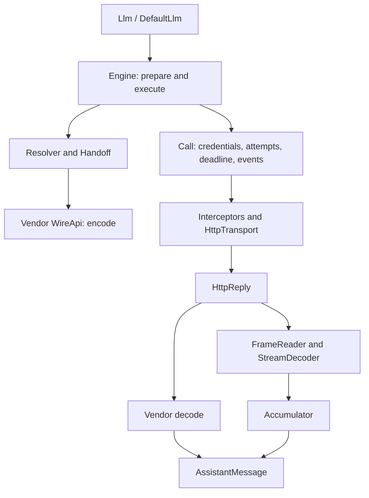

# Reliability and architecture review

Date: 27 September 2026. Scope: the `llm` implementation and its tests.

## Assessment

The project has a coherent architecture, but it was not free of reliability defects. Six findings below were reproduced with failing regression tests and fixed. Two additional findings from code inspection remain as lower-priority follow-up work.

The appropriate next step is to strengthen the existing execution and codec contracts. This review found no reason to replace the architecture or introduce additional frameworks, runtime dependencies, or build modules.

## Goals, philosophy, and architecture

The intended product is a Java library that gives coding agents, workflow builders, and multi-user services one API for connecting to LLM providers. It transports conversations, tool definitions, tool calls, results, and media. Applications retain responsibility for running tools and managing their own workflows.

The current README and final architecture supersede several broader ideas in the early requirements. For example, reactive streaming, automatic routing, transparent stream reconnection, and every cloud authentication mechanism are not requirements of the current implementation.

The implementation follows these main decisions:

- **Synchronous API first.** `Llm.complete()` returns a value or throws. `ChatStream` is a closeable blocking stream. Optional asynchronous execution uses virtual threads.
- **Explicit provider selection.** A model identifies its provider and wire protocol. There is no hidden provider fallback.
- **Provider configuration is data; protocol handling is code.** Provider presets supply endpoints and compatibility settings. Vendor codecs encode requests and decode replies without owning inference I/O.
- **Shared operational behavior.** The execution core owns authentication, retries, deadlines, cancellation, request events, caching, and stream accumulation.
- **Portable immutable conversation data.** `Handoff` adapts history when changing models, including reasoning, opaque signatures, media, and tool-call identifiers.
- **Visible consequences.** Options, warnings, partial replies, unknown outcomes, credential views, and resource ownership are explicit concepts.
- **JDK-only runtime.** The project implements its own JSON representation, serialization, SSE framing, OAuth support, and JDK HTTP transport. This keeps dependencies small but makes protocol correctness and defensive parsing the project's responsibility.

### Main execution path

`Core` owns runtime-created resources and shares them with credential views. `DefaultLlm` delegates rather than implementing every feature. `CatalogService`, the credential stores, and response caches have separate responsibilities. JPMS exports and architecture tests enforce many of these boundaries.

The strongest aspects are the pure codec boundary, testable transport SPI, ordinary Java calling style, explicit partial results, and architecture tests. The main weakness is that some strong documented guarantees were not enforced at every blocking or terminal path. Most existing tests covered ordinary success and exceptions; the added tests cover lock contention, alternative EOF behavior, and provider failure envelopes.

## Ranked findings

P1 means high impact on credentials, duplicate execution, hanging calls, or incorrect success reporting. P2 means a narrower contract or defensive-validation gap. Ranking considers both impact and the conditions required to trigger it.

| Rank | Priority | Finding | Status | Evidence |
|---|---|---|---|---|
| 1 | P1 | Stored OAuth credentials were not checked against the configured issuer and client before use | Fixed | Failing test, then passing regression |
| 2 | P1 | Generic HTTP 500/502 responses could automatically repeat generation despite an unknown outcome | Fixed | Failing test, then passing regression |
| 3 | P1 | Credential fetches and credential lock waits could outlive the total deadline | Fixed | Four failing tests, then passing regressions |
| 4 | P1 | A non-streamed Responses reply marked `failed` was treated as successful | Fixed | Failing test, then passing regression |
| 5 | P1 | A timeout-induced EOF could become successful stream completion | Fixed | Failing test, then passing regression |
| 6 | P2 | OAuth callback URLs without `state` were accepted | Fixed | Failing test, then passing regression |
| 7 | P2 | Some codec-local stream buffers bypass the central accumulation bound until completion | Open | Code inspection; no memory-exhaustion experiment |
| 8 | P2 | JSON policy deserialization bypasses builder validation | Open | Code inspection; no new regression test |

### 1. OAuth credential binding

**Location:** `internal/auth/oauth/StandardOAuth.java`, `toAuth`, `refresh`, and `revoke`.

Credentials record an issuer and client identifier, but the standard flow did not compare them with its own configuration. Reusing a store after changing a provider's OAuth configuration could expose an old access token through the new flow or send an old refresh token to the new token endpoint. The refresh coordinator checked the returned principal only after the network request, which was too late to prevent disclosure.

**Fix:** reject mismatches with `login_required` before producing authorization headers or contacting the refresh endpoint. Revocation of a foreign credential sends nothing and returns normally, so `Auth.revoke()` still deletes the stale credential locally instead of failing with `login_required` and leaving it stuck. Validate custom token-mapper results during login, and report rejected stored credentials as `NOT_CONFIGURED` in local auth status. Tests cover both issuer and client mismatches, mapper usability, status, and the absence of requests to the local issuer for foreign credentials.

**Boundary:** this validates the standard OAuth implementation. Custom `OAuthAuth` implementations remain responsible for binding their credentials. The existing credential model does not record every endpoint URL, so this is not a new arbitrary-endpoint allowlist.

### 2. Ambiguous failures and duplicate execution

**Location:** `config/RetryPolicy.java` and `internal/http/HttpErrors.java`.

HTTP 500 and 502 were in the default retry set, while only 504 was marked as an unknown outcome. A server or gateway can fail after the upstream request has been processed. The regression endpoint returns one ambiguous failure and then a success: the original implementation sent generation again and returned success, hiding the first attempt's uncertainty.

**Fix:** remove 500/502 from the default retry set and classify generic 500/502/504 as `outcomeUnknown=true`. Merely adding an ambiguous status to a policy does not override the outcome guard. A codec with a concrete provider guarantee can refine the error classification, and the host can explicitly enable that status.

This follows the distinction between replayable request bytes and safe repetition of a non-idempotent operation in [HTTP semantics, section 9.2.2](https://www.rfc-editor.org/rfc/rfc9110.html#section-9.2.2). The test proves duplicate transmission, not actual duplicate billing at a live provider.

### 3. Deadline enforcement during credentials and lock contention

**Locations:** `internal/core/Call.java`, `internal/auth/KeyAuth.java`, and the memory/file credential stores.

The blocking helper registered cancellation interrupts but did not run a deadline watchdog. A dynamic token supplier that took two seconds therefore held a call with a 100 ms deadline for those two seconds. Separately, synchronized credential locks could not be interrupted while another call held them.

**Fix:** apply the deadline watchdog during blocking phases and translate interrupted authentication work into the call's timeout or cancellation exception. A scoped interrupt guard prevents a late callback from interrupting the caller's next operation. Replace the SDK's token and credential-update monitor waits with interruptible locks, preserving serialized refresh and atomic store updates.

An OAuth refresh interrupted this way is not a rejected refresh token: it is neither recorded as `REFRESH_FAILED` in the auth status nor reported as a `CredentialEvent.RefreshFailed`; the call fails with its timeout or cancellation and the stored credential stays as it was.

Tests cover the slow fetch, another call waiting behind that fetch, a memory-store waiter, separate file-store instances waiting on the same path, and a deadline during an OAuth refresh. Existing cancellation and external-interrupt tests continue to pass.

**Boundary:** interruption is cooperative. A caller-supplied SPI that ignores interruption can still block. This change does not forcibly stop arbitrary user code.

### 4. Failed Responses objects reported as success

**Location:** `vendors/openai/internal/ResponsesCodec.java`, `decode`; partial-result handling in `Call.fail`.

A JSON response with `status=failed` produced an `AssistantMessage` with `StopReason.ERROR`, but returned normally. The engine could emit `Finished(COMPLETED)` and cache that failed response. The streamed equivalent already threw.

**Fix:** throw the typed provider error while retaining decoded partial output. Preserve an exception's partial reply when attaching call facts and emitting the failure event. Quota errors retain `quota_exhausted` in both streaming and non-streaming paths. Regressions verify the exception, partial text, error stop reason, single transmission, failed terminal event, and quota classification.

### 5. Timeout-induced EOF reported as success

**Location:** `internal/core/DefaultChatStream.java`, `step`, and `Call.checkActive`.

Not every input stream throws when closed. Some unblock by returning EOF. After a Chat Completions finish reason, the decoder accepts EOF as clean termination. If the idle watchdog closed the body while waiting for trailing data, that EOF could therefore produce a successful result.

**Fix:** check the watchdog and cancellation/deadline state immediately after reading frames and before allowing the decoder to process EOF. The regression uses a body that returns EOF when closed and verifies a timeout with the partial reply and a failed terminal event.

### 6. Missing callback state

**Location:** `internal/auth/oauth/StandardOAuth.java`, callback parsing.

The parser rejected a wrong state only when the callback supplied one. Removing the parameter bypassed that comparison. A local issuer test with a valid PKCE exchange demonstrated that such a callback completed login.

**Fix:** callback URLs and callback parameter strings must contain the expected state, including error callbacks. Explicitly pasted bare codes retain their existing supported behavior. [OAuth 2.0, section 4.1.2](https://www.rfc-editor.org/rfc/rfc6749.html#section-4.1.2) requires the authorization response to return the state supplied by the client.

PKCE was already present. The test establishes the missing transaction check; it does not demonstrate a complete account-takeover exploit. That distinction is why this finding is ranked below credential disclosure and ordinary call failures.

## Remaining findings

### 7. Codec-local buffering needs its own limits — P2

`CompletionsCodec.streamDecoder()` appends refusal text and decoded audio into local buffers. They reach the core as authoritative parts only during `finish()`. `MessagesCodec` similarly buffers input fragments for non-client-tool blocks. Each frame is bounded, but a sequence of individually valid frames can grow these buffers beyond the core's intended reply bound before the core gets a chance to reject them.

Follow-up: enforce limits before appending to these local buffers and test repeated small frames, including a stream that never sends its terminal event. This review did not induce an out-of-memory failure or change the public buffering contract.

### 8. Serialized policies accept values their builders reject — P2

`RetryPolicy.fromJson()` and `TimeoutPolicy.fromJson()` construct policies directly. They bypass the builders' positive-duration, positive-attempt, and multiplier checks. The retry parser also narrows a `long` to `int` without checking overflow. Invalid persisted configuration can consequently reach runtime code and fail later with misleading errors or altered behavior.

Follow-up: share validation between constructors/builders and JSON parsing; use checked integer conversion; retain the current partial-policy inheritance behavior. This is lower priority than the fixed failures because it requires invalid configuration rather than an ordinary network failure or concurrent call.

## Verification and limits

- Added thirteen regression tests. Each was observed failing before its corresponding fix. An independent review identified three integration gaps in the initial fixes; those were also reproduced and corrected. A second review pass corrected two side effects of the fixes: revocation of a foreign credential blocked its local removal, and a refresh interrupted by the deadline was recorded as a failed refresh.
- Final full command from `llm`: `./gradlew.bat build --offline --console=plain --no-configuration-cache`, using the installed JDK 26.
- Full build passed: compilation with warnings treated as errors, Javadoc, jars, Java/Kotlin tests, architecture checks, and external consumers on the module path and classpath.
- Final XML reports: **200 entries, 197 passed, 3 skipped, 0 failures/errors**. Skips cover opt-in live-provider testing, catalog regeneration, and POSIX permissions on Windows. Gradle's console counts the disabled parameterized live-test container differently from the XML reports.
- No billable live-provider tests were run. Scripted transports and the local OAuth issuer establish SDK behavior; they do not verify every current vendor payload, model capability, subscription entitlement, or live endpoint.
- No public method signatures or runtime dependencies were added. Observable changes include stricter OAuth rejection, conservative retries, timely timeout failures, and exceptions for failed Responses objects.
- This is a focused reliability review, not proof that the remaining code has no defects. The two open findings above are explicitly retained for follow-up.
